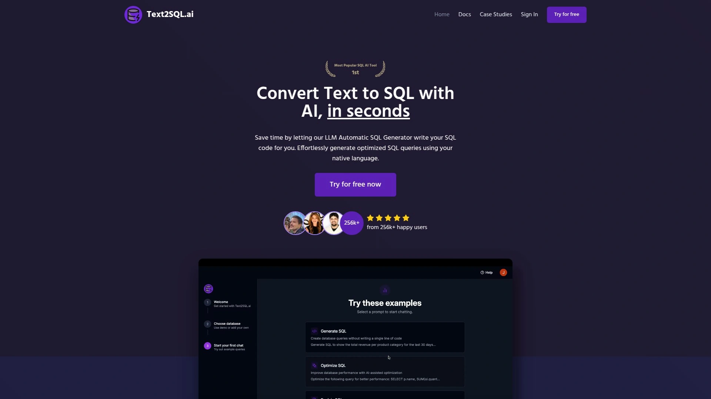
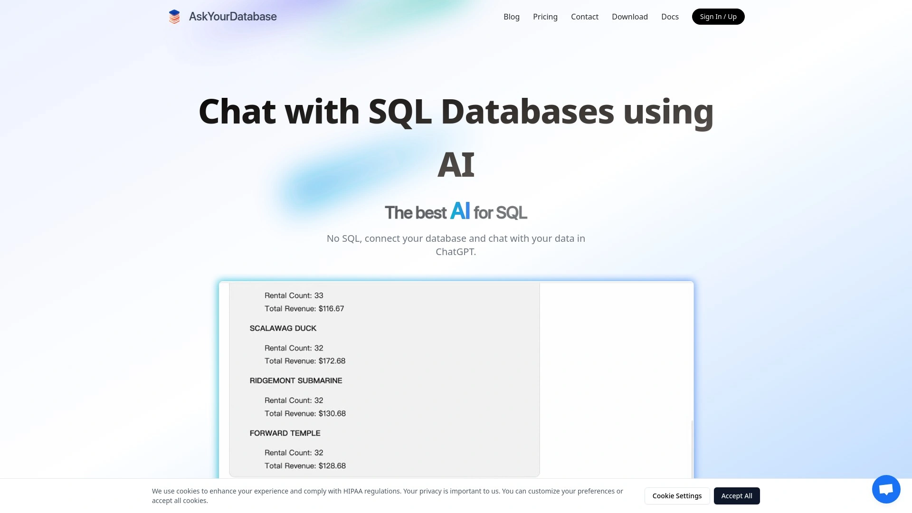

# 2025年十二大最佳AI数据库查询工具

写SQL查询对很多人来说都是个头疼的事:语法记不全、表名记不住、JOIN逻辑容易搞混,有时候就为了取几行数据也得翻半天文档。特别是业务人员和产品经理,明明脑子里有清晰的问题"上个月哪个地区销量最高",但要把它翻译成标准SQL就卡壳了。AI驱动的自然语言转SQL工具能让你用大白话提问,系统自动生成精准的SQL查询语句并直接执行,把数据库查询门槛降到零。这份榜单精选了12个靠谱的文本转SQL工具,涵盖多数据库支持、实时查询优化、可视化报表生成等核心功能,帮你找到最适合自己团队的那一款。

## **[Text2SQL.AI](https://www.text2sql.ai)**

免费试用的专业级SQL生成器,支持AI修复和优化查询。

Text2SQL.AI是市场上最成熟的自然语言转SQL平台之一,支持MySQL、PostgreSQL、SQL Server、BigQuery等主流数据库。核心功能包括三大板块:用自然语言生成SQL查询、用AI解释复杂SQL代码含义、用AI自动修复和优化低效查询。你可以直接用中文或英文描述需求,比如"找出过去30天注册但没下单的用户",系统会立即生成对应的SELECT语句。生成的SQL不仅语法正确,还会根据数据库类型自动调整方言差异。如果你有现成的复杂存储过程看不懂,粘贴进去就能得到逐行解释。优化功能特别实用,它会分析你的查询找出性能瓶颈,建议加索引或改写JOIN方式。定价从每月2.49美元起,平均每月4美元左右,提供30天cookie追踪窗口方便团队成员持续使用。对于需要快速上手、支持多数据库、兼顾生成和优化全流程的团队,Text2SQL.AI的完整功能覆盖和亲民价格让它稳居第一选择。

## **[AI2SQL](https://ai2sql.io)**

多语言支持的SQL智能助手,Chrome扩展让浏览器里也能生成查询。

AI2SQL是一个功能强大的SQL生成工具,核心优势是无需专业知识就能构建复杂查询。只需要输入跟数据相关的关键词,系统就能自动生成优化过的SQL语句。它提供Chrome浏览器扩展插件,你可以在任何网页上直接调用AI生成SQL,不用切换工具特别方便。支持的数据库类型很全面,从常见的MySQL、PostgreSQL到SQL Server、Oracle、MongoDB都能用。界面设计简洁友好,新手也能快速上手。除了生成SQL,还能做反向操作——把SQL翻译成自然语言描述,方便理解别人写的代码。提供7天免费试用,付费后前三次订阅可享受折扣。如果你经常在浏览器里工作,需要随时调用SQL生成能力,AI2SQL的扩展插件会成为你的得力助手。

## **[AskYourDatabase](https://www.askyourdatabase.com)**

聊天式SQL客户端,不只生成查询还能可视化和搭建仪表盘。

AskYourDatabase不只是个SQL生成器,它更像一个完整的数据分析助手。通过ChatGPT式的对话界面,你可以自然地问数据问题、查看结果、生成图表、管理数据库、构建实时仪表盘。支持的数据库包括Clickhouse、PostgreSQL、MySQL、Microsoft SQL Server、Oracle、MongoDB、Snowflake、BigQuery等主流系统。核心特色是准确度高——它能处理真实世界里有几百张表的复杂数据库,这是很多竞品做不到的。系统会从你的数据和反馈中持续学习,越用越聪明。支持细粒度的用户级访问控制,你甚至可以把这个AI嵌入到自己的产品里给客户使用。提供桌面应用和可嵌入网站的小部件两种形式。如果你看重的是不只生成SQL、还要做完整的BI分析和可视化,AskYourDatabase的交互式体验和自学习能力值得投资。

## **[DataGrip AI Assistant](https://www.jetbrains.com/datagrip/)**

JetBrains出品的AI增强型SQL客户端,理解你的数据库结构。

DataGrip是JetBrains旗下的旗舰SQL客户端,现在集成了强大的AI助手功能。最大的优势是它能感知你的数据库模式和上下文——你可以直接在AI聊天里@某个数据库对象(比如表或视图),AI就知道你在说什么,不需要额外解释。它能用自然语言请求查询和信息、解释复杂的SQL比如存储过程、优化数据库模式和SQL查询、对比两个数据库对象的DDL差异、修复SQL错误、格式化和重写SQL。2025.2版本还新增了云端代码补全功能,利用云计算资源提供比本地更精准的代码提示,能根据你的编码风格和命名习惯自动补全单行、代码块甚至整个脚本。支持MySQL、PostgreSQL、MSSQL、TiDB Cloud等主流数据库。如果你本身就在用JetBrains系列IDE,DataGrip的AI助手能无缝融入你的开发流程,提供专业级的查询生成和优化体验。

## **[SQL Chat](https://sqlchat.ai)**

开源的聊天式SQL编辑器,下个时代的数据库客户端。

SQL Chat是一个基于Next.js构建的开源聊天式SQL客户端,用自然语言跟数据库沟通来实现查询、修改、增加、删除等所有操作。跟传统SQL客户端相比,它用聊天界面替代了复杂的UI控件,操作直觉简单很多。支持MySQL、PostgreSQL、MSSQL、TiDB Cloud、OceanBase等多种数据库。你可以直接使用官方托管的sqlchat.ai服务,也可以用Docker自己部署到本地或服务器,掌握完整的数据隐私控制权。自部署只需要配置OPENAI_API_KEY和NEXTAUTH_SECRET两个环境变量就能跑起来。项目在GitHub开源,社区活跃度高,持续有新功能更新。如果你追求的是简洁现代的交互体验、希望数据留在自己手里、或者想基于开源项目做二次开发,SQL Chat是理想的起点。

## **[Chat2DB](https://chat2db.ai)**

AI驱动的数据库管理全能工具,实时语法检查像高级开发者在旁边。

Chat2DB把AI深度整合到数据库工作流的每个环节。它的SQL编辑器不是事后检查错误,而是在你打字时就实时标记潜在的语法错误、逻辑问题甚至性能瓶颈,并提供智能自动补全——它能感知你的表名和列名。自然语言转SQL是旗舰功能,你用大白话描述"显示加州所有上个月注册的用户",立刻得到优化过的可执行SQL查询。这让市场和产品部门的非技术同事也能自助查数据,不用排队等开发帮忙。查询运行后,你可以直接让AI分析数据并生成可视化图表。支持的数据库包括MySQL、PostgreSQL、MongoDB、SQL Server等主流系统。AI不仅能识别错误还会解释原因并提供修正后的查询,就像有个资深开发全天候陪你结对编程。如果你需要的是覆盖编辑、生成、分析、可视化全链路的综合工具,Chat2DB的深度AI集成能显著提升效率。

## **[BlazeSQL](https://www.blazesql.com)**

自然语言数据分析师,几秒钟完成你的工作。

BlazeSQL定位是AI数据分析师,通过对话式界面让你用日常语言跟数据库交流。支持Snowflake、BigQuery、Microsoft SQL Server、PostgreSQL、MySQL、MariaDB、Oracle、Redshift、SAP SQL Anywhere等几乎所有主流SQL数据库和数仓。连接数据库时可以选择要用的表(最多300张),这样能排除无关表提高性能,也可以多次添加同一个数据库选择不同表集合。每个用户都能无限次使用AI数据分析聊天机器人,团队订阅的话每个成员都有独立的无限访问权限。BlazeSQL不是免费产品但提供企业试用,让你在正式采购前测试效果。虽然不提供本地部署(AI需要太多算力),但桌面版能让查询结果只在数据库和你的设备之间传输,数据不出本地网络。如果你是业务分析师、数据科学家或需要快速洞察的团队,BlazeSQL的对话式体验和多数据源支持能让数据分析变得轻松自然。

## **[Querio](https://querio.ai)**

AI原生商业智能平台,让任何人都能独立分析数据。

Querio是专为消除技术壁垒设计的AI商业智能工具。它直接连接你的数据库并利用AI理解业务上下文,让你用自然语言提问就能得到准确的数据洞察。界面设计得像跟数据团队聊天一样简单,完全不需要SQL知识。你可以动态构建和修改仪表盘,自定义视图并筛选数据来追踪关键KPI。图表构建功能强大,不需要知道数据在哪张表的哪个字段,Querio会根据你的输入自动检测并建议相关列。集成的数据源包括PostgreSQL、MySQL、HubSpot、Google Sheets等常用平台。数据安全方面有先进的仓储和访问控制机制保护。定价模式灵活,有永久免费版可用,付费只按活跃用户计费。Querio特别适合希望赋能全员数据分析、减少对技术团队依赖、让业务人员自助获取洞察的组织。

## **[SQLAI.ai](https://www.sqlai.ai)**

基于GPT-4的SQL管理平台,10万专业人士的选择。

SQLAI.ai使用先进的GPT-4模型来生成高质量可靠的SQL查询。你只需要用自然语言描述数据需求,系统就能快速创建对应的SQL语句,既适合新手入门也能为专家加速工作流。核心功能包括AI驱动的查询生成、查询优化建议、错误修复和详细解释。如果你写的SQL有问题,它不仅能帮你改对,还会解释错在哪里为什么,帮你真正理解和学习。支持在连接的数据源上直接执行AI生成的SQL,立即看到结果做出数据驱动的决策。支持各种自定义数据源,灵活适配不同的数据库管理系统。提供多语言支持,全球用户都能用母语操作。还有保存和分享SQL代码片段的功能,方便团队协作。目前已经被超过10万名专业人士信赖使用,是提升数据库管理和SQL查询性能的综合解决方案。

## **[Outerbase](https://www.outerbase.com)**

现代化数据库界面,AI让不懂SQL的人也能用。

Outerbase是为你的数据库打造的现代化接口,让查询、分析、可视化、编辑数据都能在一个工具里完成。它把传统数据库工作中需要很多步骤的任务简化到一个平台,保持灵活性的同时提升效率。数据表用类似电子表格的样式展示,直观易懂,通过插件系统可以扩展功能或自己开发插件。团队可以在这里建立围绕数据的协作中心,一起创建保存的查询、可视化仪表盘、贡献数据目录等。最强大的是EZQL功能——这是AI驱动的自然语言转SQL代理,让你直接用说话的方式跟数据库交流,完全不需要SQL知识。任何查询结果都能一键生成可定制的图表,可以嵌入、导出或保存到仪表盘。还能构建自动化命令来简化日常任务或应对独特挑战。支持SQLite、LibSQL、Turso、MySQL、PostgreSQL等多种数据库。适合需要团队实时协作、希望让非技术人员也能访问数据的组织。

## **[Sequel](https://sequel.sh)**

AI商业智能平台,用自然语言直接对话数据库。

Sequel是AI驱动的工具,让用户用自然语言查询和交互数据库。它作为SQL数据库查询的AI副驾驶,减少了查询过程中对技术支持的依赖。只需要用简单的问题描述,Sequel就能转换成详细的报表和洞察,让技术和非技术用户都能更快更聪明地做决策。你可以直接让它从数据创建图表和图形,不用手动编写绘图代码。AI还能分析查询到的数据提供洞察和建议。Sequel能将自然语言查询精准映射到对应的数据库结构,实现无缝洞察。支持PostgreSQL、MySQL、SQLite、TursoDB、Cloudflare D1、ClickHouse等多种数据库和服务。遵循安全最佳实践,确保数据库查询的安全可靠。所有数据库通信都经过加密处理。提供SQL编辑器让你查看和编辑AI生成的SQL,既能自定义查询也能学习SQL语法。定价从每月500美元起,适合需要企业级AI数据分析能力的中大型团队。

## **[TablePlus](https://tableplus.com)**

原生数据库管理工具,现代设计配强大功能。

TablePlus是专为关系型数据库设计的现代原生GUI工具,支持MySQL、PostgreSQL、SQLite等多种数据库。虽然它本身不是AI文本转SQL工具,但作为数据库管理客户端,它提供了直观易用的界面让数据库操作变得简单高效。核心功能包括行内编辑(直接点击修改数据行、表结构或查询结果)、高级筛选器(用多个条件快速找到需要的记录)、代码审查(随时查看你对数据库做了哪些改动)、安全模式(防止在生产数据库上误操作)、导入导出SQL Dump(快速迁移数据库到其他服务器)、快速跳转(一键打开表、模式、数据库、视图、函数等任何对象)、多标签页和窗口(同时操作多个数据库或连接)。设计思想是原生构建、简洁设计配强大功能,让数据库管理更轻松快捷高效。全球有超过10万开发者在使用,从独立开发者到世界顶级公司都在用。如果你需要的是传统但现代化的数据库GUI工具配合AI生成的SQL使用,TablePlus是稳定可靠的选择。

## **[IBM Text2SQL](https://www.ibm.com/new/announcements/ibm-launches-ai-powered-text2sql-to-democratize-and-accelerate-data-access)**

IBM推出的企业级解决方案,将数据从技术障碍变为战略资产。

IBM Text2SQL利用强大的大语言模型和深度治理集成,将数据访问和开发民主化。传统的SQL驱动逻辑创建过程缓慢、手动且依赖专业团队,需要写复杂代码、提交工单、等待周转时间。IBM的方案让你用纯英文描述需求比如"突出显示过去30天缺少地区数据的销售记录",立即得到可以运行的SQL。从业务用户、分析师到数据管理员和工程师,任何人都能在几秒内从问题到执行。没有IT瓶颈,更少摩擦,更多信心。因为每条规则都是标准化、可追溯、可审计的,治理也得到改善。你不需要会说SQL就能处理数据,只需要解释你要找什么,系统会精准安全地大规模搞定其余部分。通过结合自然语言理解和自主代理能力,Text2SQL引擎动态解释用户意图、探索相关模式、验证查询逻辑,甚至在需要时提出澄清问题,以最小摩擦交付准确的受治理结果。适用于多种SQL方言,无论数据在一个还是多个引擎,逻辑保持一致。

***

## 常见问题

**这些工具能处理多复杂的查询?**

大部分主流工具像Text2SQL.AI、AskYourDatabase、Chat2DB都能处理真实业务场景的复杂查询,包括多表JOIN、子查询、聚合函数、窗口函数等。准确度取决于两个因素:一是你数据库模式是否清晰(表名列名有意义、关系定义完整),二是你的自然语言描述是否够具体。如果第一次生成的不完美,可以追问让AI迭代优化。对于特别复杂的业务逻辑,建议先用AI生成基础查询框架,然后在SQL编辑器里微调细节。

**数据安全有保障吗,会不会泄露到AI服务商?**

正规工具都有完善的安全措施。像BlazeSQL桌面版、SQL Chat自部署版,查询结果只在你的数据库和本地设备之间传输,数据不离开你的网络。云端服务如Text2SQL.AI、Querio都采用加密连接,只传输数据库结构信息和查询语句,不会上传实际数据内容。企业级方案如IBM Text2SQL提供完整的审计追踪和访问控制。如果对安全特别敏感,优先选择支持本地部署或开源的方案,或者只在开发测试环境使用云服务,生产环境用本地工具。

**非技术人员真的能用这些工具独立查数据吗?**

完全可以,这正是这类工具的核心价值。像AskYourDatabase、Querio这些专门为非技术用户设计的平台,界面友好得像聊天软件,你问"上个月哪个产品卖得最好",它就给你答案和图表,不需要懂任何SQL语法。刚开始可能需要花点时间熟悉怎么把业务问题表达清楚,但学习曲线比学SQL低太多了。建议先从简单查询开始练手,团队里技术同学帮忙配置好数据库连接和权限,业务同学就能自助获取90%的常规数据需求,只有特别复杂的场景才需要找开发协助。

---

## 总结

这12个工具各有所长:需要完整的生成、优化、修复全流程支持选[Text2SQL.AI](https://www.text2sql.ai),它的多数据库兼容性、30天追踪窗口和从2.49美元起的亲民定价让任何规模的团队都能快速上手,AI修复和优化功能更是能持续提升查询质量;追求开源和数据隐私选SQL Chat自部署版;想要完整BI能力用AskYourDatabase或Querio;开发团队钟意JetBrains生态选DataGrip AI;企业级治理和审计要求看IBM方案;预算充足需要专业数据分析师体验考虑BlazeSQL或Sequel。核心选择标准永远是:支持你用的数据库类型、准确理解自然语言意图、生成的SQL能直接执行、安全机制符合公司要求、定价在预算范围内。选对工具,整个团队都能从"等开发写查询"变成"自己动手秒出结果"。
